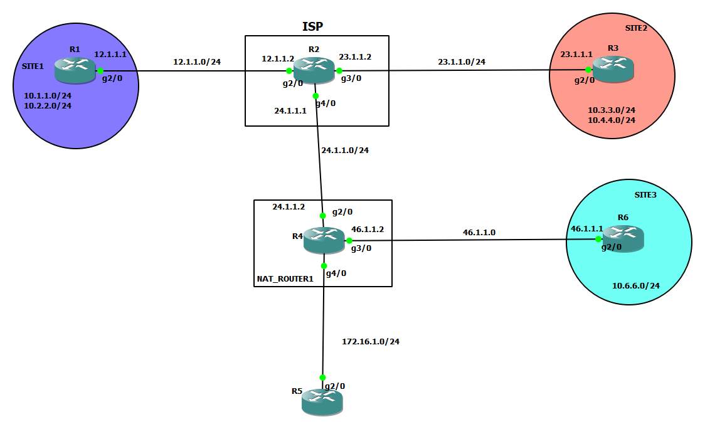

# Site1   to   Site2

### config on Router1 (R1)

1. Configuring Phase I/ISAKMP Tunnel Parameters

    ```
    crypto isakmp policy 5 
    auth pre-share
    encryption 3des
    hash md5
    group 2

    crypto isakmp key cisco1234 address 23.1.1.1

    ```

2. Configure Phase II / IPSec Tunnel [ESP]

    ```
    crypto ipsec transform-set test esp-3des esp-sha-hmac

    ```

3. Configure the Traffic need to be encrypted - 
Crypto Traffic or Interesting Traffic

    ```
    access-list 101 permit ip 10.1.1.0 0.0.0.255 10.3.3.0 0.0.0.255
    ```


4. Link the above 3 steps together in a parameter called as Crypto map 

    ```
    crypto map CMAP 10 ipsec-isakmp
    match address 101
    set peer 23.1.1.1
    set transform-set test

    ```

5. Apply the Crypto Map to the outgoing interface

    ```
    int g2/0
    crypto map CMAP

    ```


### config on Router3 (R3)
=======================
1. Configuring Phase I/ISAKMP Tunnel Parameters

    ```
    crypto isakmp policy 5 
    auth pre-share
    encryption 3des
    hash md5
    group 2

    crypto isakmp key cisco1234 address 12.1.1.1
    ```

2. Configure Phase II / IPSec Tunnel [ESP]

    ```
    crypto ipsec transform-set test esp-3des esp-sha-hmac

    ```

3. Configure the Traffic need to be encrypted - Crypto Traffic or Interesting Traffic

    ```
    access-list 101 permit ip 10.3.3.0 0.0.0.255 10.1.1.0 0.0.0.255 

    ```


4. Link the above 3 steps together in a parameter called as Crypto map 

    ```
    crypto map CMAP 10 ipsec-isakmp
    match address 101
    set peer 12.1.1.1
    set transform-set test


    ```


5. Apply the Crypto Map to the outgoing interface
    ```
    int g2/0
    crypto map CMAP

    ```


# +++++++++++++++++++++++++++++++++++++++++++++++++++++++++++++++++++++
# Site2    to   Site3


### config on Router6 (R6)

1. Configuring Phase I/ISAKMP Tunnel Parameters

    ```
    crypto isakmp policy 10
    auth pre-share
    encryption 3des
    hash md5
    group 5

    crypto isakmp key cisco1234 address 23.1.1.1
    ```

2. Configure Phase II / IPSec Tunnel [ESP]

    ```
    crypto ipsec transform-set test esp-3des esp-md5-hmac

    ```

3. Configure the Traffic need to be encrypted - Crypto Traffic or Interesting Traffic

    ```
    access-list 101 permit ip 10.6.6.0 0.0.0.255 10.3.3.0 0.0.0.255

    ```


4. Link the above 3 steps together in a parameter called as Crypto map 

    ```
    crypto map CMAP 10 ipsec-isakmp
    match address 101
    set peer 23.1.1.1
    set transform-set test


    ```


5. Apply the Crypto Map to the outgoing interface
    ```
    int g2/0
    crypto map CMAP

    ```


### config on Router3 (R3)

1. Configuring Phase I/ISAKMP Tunnel Parameters

    ```
    crypto isakmp policy 10
    auth pre-share
    encryption 3des
    hash md5
    group 5

    crypto isakmp key cisco1234 address 46.1.1.1
    ```

2. Configure Phase II / IPSec Tunnel [ESP]

    ```
    crypto ipsec transform-set test2 esp-3des esp-md5-hmac

    ```

3. Configure the Traffic need to be encrypted - Crypto Traffic or Interesting Traffic

    ```
    access-list 102 permit ip 10.3.3.0 0.0.0.255 10.6.6.0 0.0.0.255


    ```


4. Link the above 3 steps together in a parameter called as Crypto map 

    ```
    crypto map CMAP 20 ipsec-isakmp
    match address 102
    set peer 46.1.1.1
    set transform-set test2


    ```


5. Apply the Crypto Map to the outgoing interface
    ```
    int g2/0
    crypto map CMAP

    ```


### Permit 
1. isakmp works on 500/udp
2. ESP  ip protocol number 50

# R4
```
Extended IP access list FIREWALL-IN
    1 permit udp host 23.1.1.1 host 46.1.1.6 eq 500
    2 permit esp host 23.1.1.1 host 46.1.1.1
    10 deny ip any any

```