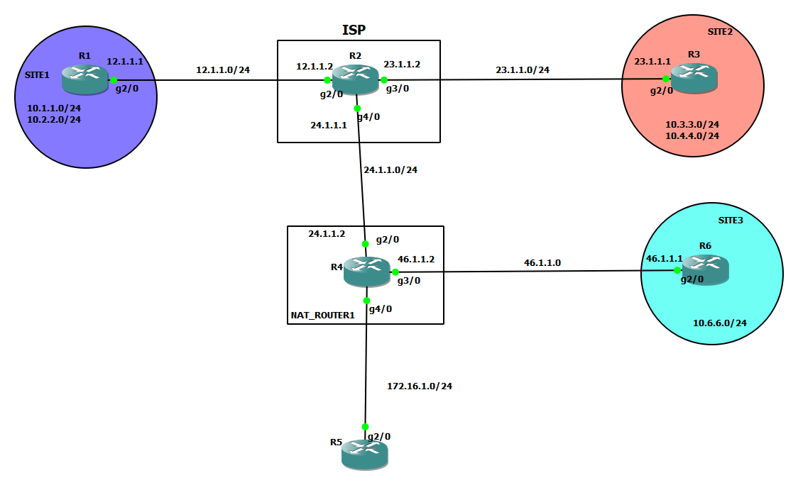

# IPSec
### What is IPSec
IPsec stands for **Internet Protocol Security**. It is a group of protocols that provides secure communication between devices by encrypting and authenticating data sent over public networks, such as the Internet. IPsec is often used to set up VPNs (Virtual Private Networks). It works by encrypting IP packets and authenticating the source where the packets come from. IPsec uses UDP as its transport protocol, which allows it to get through firewalls. 

### What is L2L IPSec
L2L IPSec stands for **LAN-to-LAN IPsec**. It is a type of VPN connection that allows two or more private networks to securely communicate with each other over the public internet. This type of VPN is commonly used by businesses to connect remote offices or to allow employees to work from home securely. The connection is established between two routers, and the data is encrypted using the IPsec protocol.


[ref](https://www.cisco.com/c/en/us/support/docs/routers/1700-series-modular-access-routers/71462-rtr-l2l-ipsec-split.html)
# LAN 2 LAN [L2L] IPSec setup




# Site1   to   Site2

### config on Router1 (R1)

1. Configuring Phase I/ISAKMP Tunnel Parameters

    ```
    crypto isakmp policy 5 
    auth pre-share
    encryption 3des
    hash md5
    group 2

    crypto isakmp key cisco1234 address 23.1.1.1

    ```

2. Configure Phase II / IPSec Tunnel [ESP]

    ```
    crypto ipsec transform-set test esp-3des esp-sha-hmac

    ```

3. Configure the Traffic need to be encrypted - 
Crypto Traffic or Interesting Traffic

    ```
    access-list 101 permit ip 10.1.1.0 0.0.0.255 10.3.3.0 0.0.0.255
    ```


4. Link the above 3 steps together in a parameter called as Crypto map 

    ```
    crypto map CMAP 10 ipsec-isakmp
    match address 101
    set peer 23.1.1.1
    set transform-set test

    ```

5. Apply the Crypto Map to the outgoing interface

    ```
    int g2/0
    crypto map CMAP

    ```


### config on Router3 (R3)
=======================
1. Configuring Phase I/ISAKMP Tunnel Parameters

    ```
    crypto isakmp policy 5 
    auth pre-share
    encryption 3des
    hash md5
    group 2

    crypto isakmp key cisco1234 address 12.1.1.1
    ```

2. Configure Phase II / IPSec Tunnel [ESP]

    ```
    crypto ipsec transform-set test esp-3des esp-sha-hmac

    ```

3. Configure the Traffic need to be encrypted - Crypto Traffic or Interesting Traffic

    ```
    access-list 101 permit ip 10.3.3.0 0.0.0.255 10.1.1.0 0.0.0.255 

    ```


4. Link the above 3 steps together in a parameter called as Crypto map 

    ```
    crypto map CMAP 10 ipsec-isakmp
    match address 101
    set peer 12.1.1.1
    set transform-set test


    ```


5. Apply the Crypto Map to the outgoing interface
    ```
    int g2/0
    crypto map CMAP

    ```


# L2L Through a firewall
# Site2    to   Site3


### config on Router6 (R6)

1. Configuring Phase I/ISAKMP Tunnel Parameters

    ```
    crypto isakmp policy 10
    auth pre-share
    encryption 3des
    hash md5
    group 5

    crypto isakmp key cisco1234 address 23.1.1.1
    ```

2. Configure Phase II / IPSec Tunnel [ESP]

    ```
    crypto ipsec transform-set test esp-3des esp-md5-hmac

    ```

3. Configure the Traffic need to be encrypted - Crypto Traffic or Interesting Traffic

    ```
    access-list 101 permit ip 10.6.6.0 0.0.0.255 10.3.3.0 0.0.0.255

    ```


4. Link the above 3 steps together in a parameter called as Crypto map 

    ```
    crypto map CMAP 10 ipsec-isakmp
    match address 101
    set peer 23.1.1.1
    set transform-set test


    ```


5. Apply the Crypto Map to the outgoing interface
    ```
    int g2/0
    crypto map CMAP

    ```


### config on Router3 (R3)

1. Configuring Phase I/ISAKMP Tunnel Parameters

    ```
    crypto isakmp policy 10
    auth pre-share
    encryption 3des
    hash md5
    group 5

    crypto isakmp key cisco1234 address 46.1.1.1
    ```

2. Configure Phase II / IPSec Tunnel [ESP]

    ```
    crypto ipsec transform-set test2 esp-3des esp-md5-hmac

    ```

3. Configure the Traffic need to be encrypted - Crypto Traffic or Interesting Traffic

    ```
    access-list 102 permit ip 10.3.3.0 0.0.0.255 10.6.6.0 0.0.0.255


    ```


4. Link the above 3 steps together in a parameter called as Crypto map 

    ```
    crypto map CMAP 20 ipsec-isakmp
    match address 102
    set peer 46.1.1.1
    set transform-set test2


    ```


5. Apply the Crypto Map to the outgoing interface
    ```
    int g2/0
    crypto map CMAP

    ```


### Permit 
1. isakmp works on 500/udp
2. ESP  ip protocol number 50

# R4
```
Extended IP access list FIREWALL-IN
    1 permit udp host 23.1.1.1 host 46.1.1.6 eq 500
    2 permit esp host 23.1.1.1 host 46.1.1.1
    10 deny ip any any

```